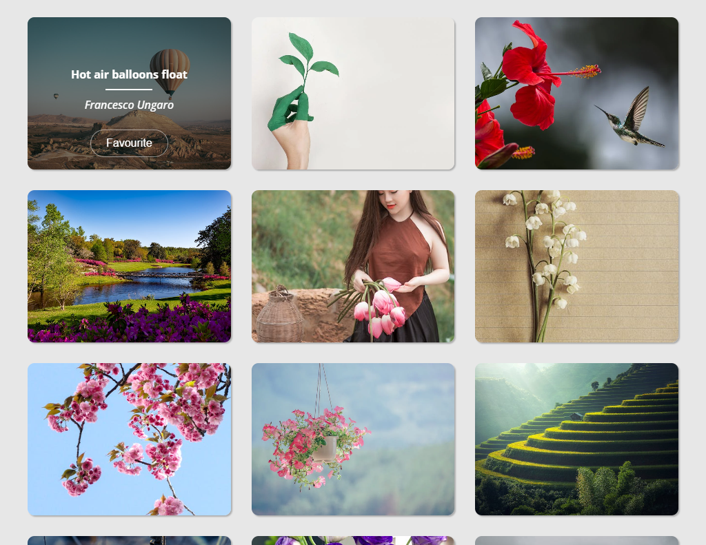

# Take-home technical assignment for prospective Web Engineers at Vinted

## ✒️ Author: Modestas Anilionis

## Intro

I would like to thank the Vinted team for giving me the opportunity to participate in this technical assignment. It was an interesting challenge and a great learning experience. I appreciate the chance to showcase my skills and look forward to hearing from you soon. Thank you!👨‍💻

## 🛠️ Technical stack:

- Frontend: **React.JS, Vite**
- Tests: **Vitest, React Testing Library**

## 📌 Main features:

- Infinity scroll through images
- Images favouriting and unfavouriting
- Responsive design with 3 breakpoints (mobile, tablet, pc)

## 📄 Documentation for install:

1. Clone Repository

   ```bash
   git clone https://github.com/vinted-hw/academy-web-homework-meModiz
   ```

2. Install dependencies **(recommended to use pnpm)**

   ```bash
   pnpm install
   ```

3. Or use npm (not recommended)

   ```bash
   npm install
   ```

4. Setup API Key in local environment:

   1. In project folder _(academy-web-homework-meModiz)_ create `.env.local` file
   2. Setup your API KEY like that (You can get your API at https://www.pexels.com/api/key/):

      ```
      VITE_PEXELS_API_KEY="YOUR_API_KEY"
      ```

   - **Additional information for API Key setup:**

     - Please include (in the repository) an API key so that we can test the app. _(from homework-assignment.md)_
       - My API KEY:
       ```
       VITE_PEXELS_API_KEY="iWfsOujLEJmeh5szpPoEFA9Mv5K0yf74Y5RGRTdEtezZ5pXf9pj8uO8i"
       ```

- Run & Test Project

  - Run tests

  ```bash
  pnpm test
  ```

  - Start application (dev)

  ```bash
  pnpm dev
  ```

## 📸 Showcase:

<a href="./showcase_screenshots/preview_hover.png">
<a href="./showcase_screenshots/preview.png">
